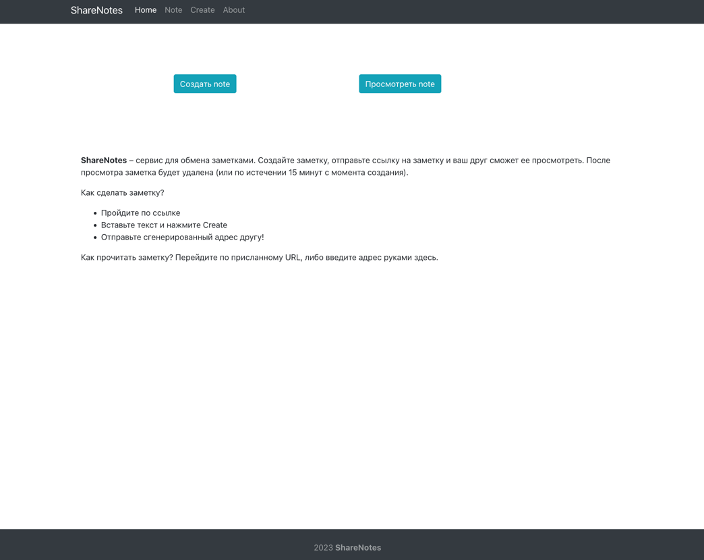

# SPA Сервис для обмена шифрованными сообщениями.
### Стек - React, Prettier, NodeJs, React Router Dom, Bootstrap.
#### Локально поднимается бэкенд, при запросе с фронтенда создается запись в бд (базе данных) и с бэкенда приходит хеш, который можно вставить в поле и прочитать сообщение.

### Демонстрация интерфейса

---
#### Для запуска бэкенда локально надо:
- Запустить внутри директории backend_project команду npm i;
- Запустить команду node index.js;
- Локально развернуть базу данных (бд), используется MySQL, для локального запуска можно использовать mamp/open server;
- Производить запуск бд надо на дефолтном порту для MySQL - 3306 (можно использовать phpMyAdmin);
- Затем создать внутри админки новую бд с именем reactjs и сделать импорт файла backend_project/reactjs.sql.
